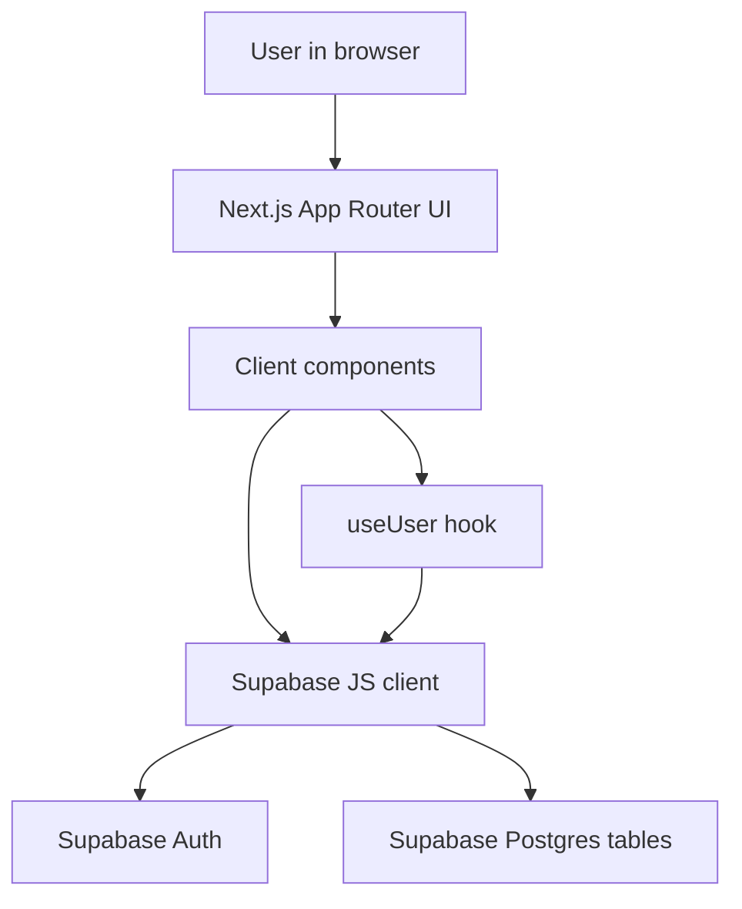
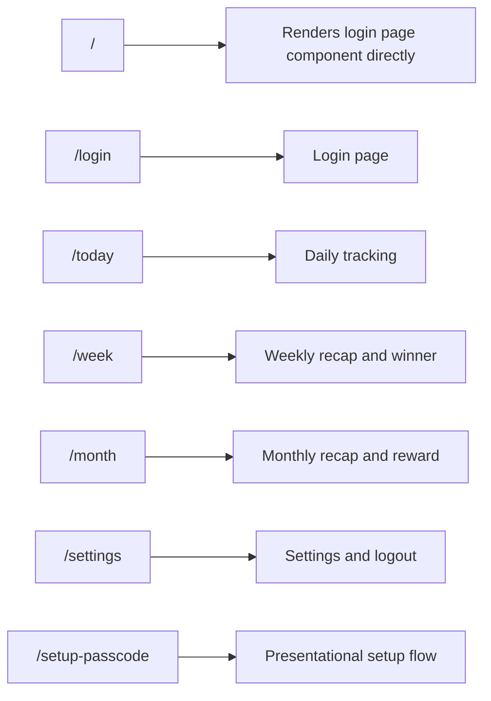
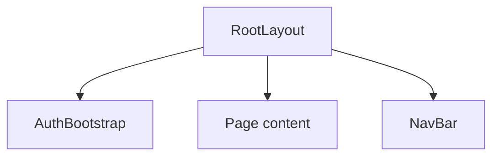
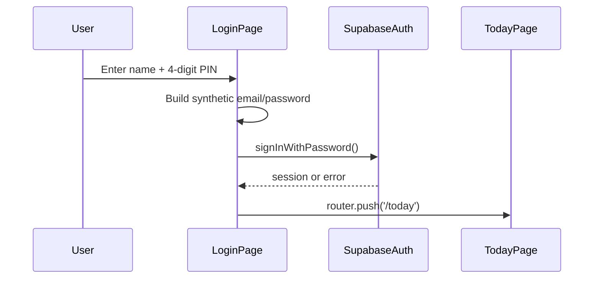
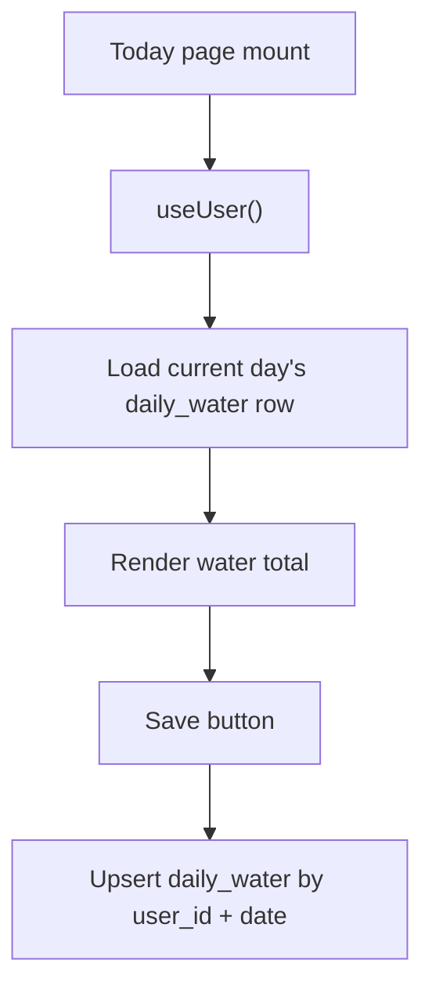
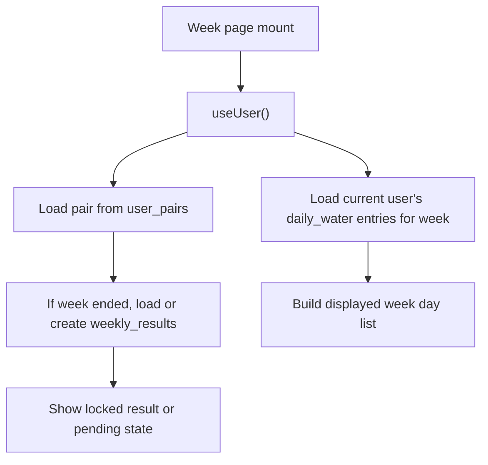
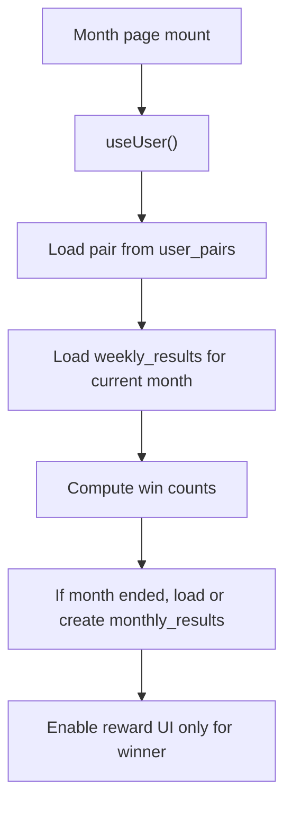

# Architecture

## High-Level Architecture
The application is a client-rendered Next.js App Router application. All business logic currently executes in client components. Supabase is called directly from the browser for authentication and CRUD operations.

There is no backend layer inside this repository.

## Runtime Boundaries

### Presentation Layer
- `src/app/layout.tsx`
- `src/app/globals.css`
- page files under `src/app/**/page.tsx`
- `src/components/NavBar.tsx`

### Client-Side Data/Session Layer
- `src/lib/supabase.ts`
- `src/lib/useUser.ts`
- `src/lib/auth.ts`
- `src/components/AuthBootstrap.tsx`

### External Platform
- Supabase Auth
- Supabase Postgres

## Route Architecture

## Layout Composition

Notes:
- `NavBar` is always rendered, including on `/login`.
- The login page visually occupies the full screen, so the persistent nav may be unintentionally present beneath it.
- There is no route group or separate authenticated shell.

## State Management
State management is fully local and component-scoped.

Patterns in use:
- `useState` for page-local UI and fetched data.
- `useEffect` for initial data fetches and time-based updates.
- No context providers.
- No Redux, Zustand, Jotai, TanStack Query, SWR, or React context state layer.
- No server state cache abstraction.

### Today Page State
- `water`
- `customAmount`
- `showCustomInput`
- `saved`
- `now`
- `user/loading` from `useUser`

### Week Page State
- `weekEntries`
- `weeklyTotals`
- `weeklyWinnerState`
- `partnerId`
- `user/loading` from `useUser`

### Month Page State
- `weeklyResults`
- `monthlyResult`
- `partnerId`
- `user/loading` from `useUser`

### Navigation State
- `pathname`
- scroll-driven visibility state in `NavBar`

## Authentication Architecture
Authentication is fully client-side through Supabase Auth.

Flow:
1. User enters a name and four PIN digits.
2. The login page normalizes the name to lowercase.
3. The app synthesizes credentials:
   - `email = ${normalizedName}@water.app`
   - `password = water-${pin}-lock`
4. The app calls `supabase.auth.signInWithPassword`.
5. On success, the router pushes to `/today`.
6. Session lookups later rely on `supabase.auth.getUser()`.

Important limitations:
- No sign-up flow exists.
- No forgot-passcode flow exists.
- No route guard exists.
- `useUser()` only fetches once on mount and does not subscribe to auth changes.
- `AuthBootstrap` subscribes to auth changes but only logs the user ID to the console.

## Data Flow By Screen

### Today

### Week

### Month

## Database Access Pattern
The code uses direct table access from page components. There is no repository layer, no service layer, and no typed query abstraction.

Observed tables:
- `daily_water`
- `user_pairs`
- `weekly_results`
- `monthly_results`

## Build and Tooling Architecture
- Next.js `16.1.6`
- React `19.2.3`
- TypeScript strict mode enabled
- Tailwind CSS v4 through `@tailwindcss/postcss`
- React Compiler enabled in `next.config.ts`
- ESLint uses `eslint-config-next` core web vitals and TypeScript presets

## Notable Architectural Risks
- Business logic is duplicated across pages.
- Date handling is client-local and may drift across time zones.
- Page components mix rendering, copy, data access, calculations, and persistence.
- Hard-coded labels and static placeholder values make the UI look more complete than the implementation actually is.
- Committed `.env.local` indicates secrets/config hygiene issues.
