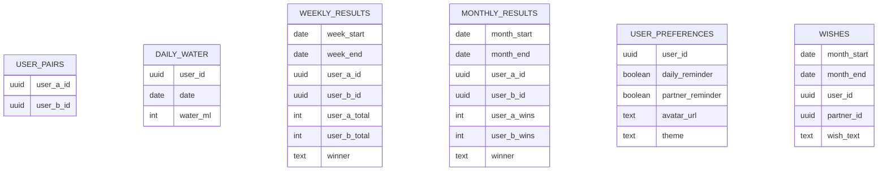

# Database

## Source Of Truth
The checked-in SQL migration at
[`supabase/migrations/0001_baseline_and_features.sql`](../supabase/migrations/0001_baseline_and_features.sql)
is the source of truth for schema, constraints, and Row Level Security
policies. It's idempotent (`create table if not exists`, `drop policy if
exists` + recreate) so it's safe to re-run against a database that already
has the tables populated with real data.

Run it once against a fresh or existing Supabase project via the SQL Editor,
or `supabase db push` if you adopt the Supabase CLI locally. There is no
Supabase CLI config (`supabase/config.toml`) checked in — only the Edge
Function and this migration file.

## Database Provider
- Supabase Postgres, accessed directly from the browser via the public anon
  key (`src/lib/supabase.ts`). There is no backend/API layer in this repo —
  RLS is the only access control.

## Tables

### `daily_water`
One row per user per calendar day.

| column     | type      | notes                                |
|------------|-----------|---------------------------------------|
| `user_id`  | uuid      | FK to `auth.users`, part of PK        |
| `date`     | date      | local calendar date, part of PK       |
| `water_ml` | integer   | clamped client-side to `[0, 20000]`   |

RLS: a user can always read/write their own rows, and read (not write) their
paired partner's rows.

### `user_pairs`
Defines the two-person pairing that powers weekly/monthly comparison.

| column       | type | notes                  |
|--------------|------|------------------------|
| `id`         | uuid | PK                     |
| `user_a_id`  | uuid | FK to `auth.users`     |
| `user_b_id`  | uuid | FK to `auth.users`     |

There is no app flow that creates a pairing — it's seeded by whoever
administers the Supabase project (insert one row per pair directly, or via
the SQL Editor). RLS only allows each half of a pair to *read* their own row.

### `weekly_results`
One row per completed week per pair, computed and inserted client-side once
the week has ended (Monday–Sunday, unlocked the following Monday at local
midnight — see `src/lib/date.ts`).

| column           | type    |
|------------------|---------|
| `id`             | uuid PK |
| `week_start`     | date    |
| `week_end`       | date    |
| `user_a_id`      | uuid    |
| `user_b_id`      | uuid    |
| `user_a_total`   | integer |
| `user_b_total`   | integer |
| `winner`         | text — one of the two user ids, or `"tie"` |

Unique on `(week_start, week_end, user_a_id, user_b_id)`.

### `monthly_results`
One row per completed calendar month per pair, computed from that month's
`weekly_results` rows (win counts, not raw totals).

| column          | type    |
|-----------------|---------|
| `id`            | uuid PK |
| `month_start`   | date    |
| `month_end`     | date    |
| `user_a_id`     | uuid    |
| `user_b_id`     | uuid    |
| `user_a_wins`   | integer |
| `user_b_wins`   | integer |
| `winner`        | text — one of the two user ids, or `"tie"` |

Unique on `(month_start, month_end, user_a_id, user_b_id)`.

### `user_preferences`
Per-user settings, one row per user.

| column              | type    | notes                              |
|---------------------|---------|-------------------------------------|
| `user_id`           | uuid PK | FK to `auth.users`                  |
| `daily_reminder`    | boolean | default false; opts into the scheduled `daily-reminder` push |
| `partner_reminder`  | boolean | default false; whether this user allows their partner to send a manual "Remind" push |
| `avatar_url`        | text    | nullable; public URL in the `avatars` storage bucket |
| `theme`             | text    | one of `calm` / `focused` / `bold`, default `calm` |

RLS: a user manages their own row; their paired partner can read it (for
avatar display, and to check `partner_reminder` before showing the "Remind"
button), but not write it.

### `push_subscriptions`
One row per user's web push subscription, written by `usePushNotifications`
and read by the `send-push` / `daily-reminder` Edge Functions (via the shared
`supabase/functions/_shared/push.ts` helper) using the service role key
(which bypasses RLS). An expired/unsubscribed subscription is deleted
automatically the next time a push to it is rejected by the push service.

| column          | type      |
|-----------------|-----------|
| `user_id`       | uuid PK   |
| `subscription`  | jsonb     |
| `updated_at`    | timestamptz |

RLS: strictly private to the owning user.

### `wishes`
The monthly winner's reward message, one per month per pair.

| column        | type    |
|---------------|---------|
| `id`          | uuid PK |
| `month_start` | date    |
| `month_end`   | date    |
| `user_id`     | uuid — the winner who wrote the wish |
| `partner_id`  | uuid — the recipient |
| `wish_text`   | text    |

Unique on `(month_start, month_end, user_id)`. RLS insert policy re-derives
winner status from `monthly_results` server-side, so a client can't insert a
wish it didn't actually earn.

## Storage

### `avatars` bucket
Public bucket for profile photos, one file per user at
`avatars/<user_id>/avatar.<ext>`. Anyone can read; a user can only
insert/update/delete inside their own `<user_id>/` folder (enforced via
`storage.foldername(name)` in the RLS policy).

## Relationship Model

## Security Notes
- RLS is enabled on every table; see the migration for exact policies.
- The app uses the public anon key directly from the browser — RLS is the
  *only* access control layer, so any new query added to the app needs a
  matching policy or it will silently return no rows.
- `push_subscriptions` cross-user reads only happen through the Edge
  Function's service-role client, never from the browser.

## Known Constraints
- This is a fixed two-person app (`src/lib/users.ts` hard-codes the two
  display names). A third Supabase user can sign up via `/setup-passcode`,
  but nothing will pair them with anyone — `user_pairs` rows are seeded by
  hand.
- Application-level TypeScript row shapes live in `src/lib/types.ts` and are
  kept in sync with this migration by hand — there's no `supabase gen types
  typescript` output checked in (would require Supabase CLI access to the
  live project).
