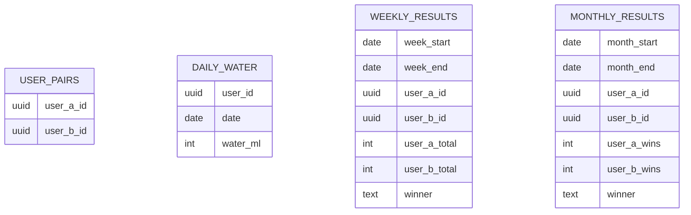

# Database

## Source Of Truth
The repository does not contain database migrations, SQL schema files, generated types, or Supabase config. Everything below is derived from live query usage in application code.

Where an item is not directly visible in code, it is marked as inferred.

## Database Provider
- Supabase Postgres

## Confirmed Tables Referenced In Code
- `daily_water`
- `user_pairs`
- `weekly_results`
- `monthly_results`

## Table-Level Understanding

### `daily_water`
Confirmed usage:
- queried by `user_id`
- queried by `date`
- selected column `water_ml`
- upsert conflict target `user_id,date`

Strong inference:
- unique constraint exists on `(user_id, date)`

Inferred shape:

```text
daily_water
- user_id
- date
- water_ml
```

Purpose:
- store one user's water total for a calendar day

### `user_pairs`
Confirmed usage:
- queried where current user matches either `user_a_id` or `user_b_id`
- result used to derive the partner user ID

Inferred shape:

```text
user_pairs
- user_a_id
- user_b_id
```

Purpose:
- define the two-person pairing that powers weekly/monthly comparison

### `weekly_results`
Confirmed usage:
- stores totals for a finished week
- stores winner
- keyed by week range and pair IDs in current code

Inferred shape:

```text
weekly_results
- week_start
- week_end
- user_a_id
- user_b_id
- user_a_total
- user_b_total
- winner
```

Important implementation note:
- the week page does not currently compute partner totals from `daily_water`
- `weeklyTotals` is only populated when a `weekly_results` row already exists
- this means insertion of a new weekly result may never happen from current code unless `weeklyTotals` is somehow set earlier

### `monthly_results`
Confirmed usage:
- stores monthly win counts and winner
- inserted after month end when no row exists

Inferred shape:

```text
monthly_results
- month_start
- month_end
- user_a_id
- user_b_id
- user_a_wins
- user_b_wins
- winner
```

## Relationship Model



## Schema Gaps
- no primary keys visible in repo
- no foreign keys visible in repo
- no indexes visible in repo
- no RLS policies visible in repo
- no trigger/functions visible in repo
- no created/updated timestamps visible in repo

## Security Implications
Because the app uses the public anon key directly in client code, safe operation depends on Supabase-side controls that are not stored in this repository:
- Row Level Security
- auth-user-based access restrictions
- insert/update policy constraints

These cannot be verified from local files.

## Data Integrity Risks In Current Code
- Today page allows subtraction without floor validation, so negative totals are possible in UI state.
- Week and month computations rely on local time-derived date ranges.
- Participant naming is decoupled from database identities and instead based on email prefix heuristics.
- `participants.ts` exports a hard-coded user ID that is unused and undocumented.
